# Hammerspoon/Hammerflow Architecture

This document provides a visual overview of how Hammerspoon, Hammerflow, and all related components interact.

## System Architecture Diagram

```mermaid
flowchart TB
    subgraph macOS["macOS System"]
        HS[("Hammerspoon<br/>Application")]
    end

    subgraph Init["Bootstrap (~/.hammerspoon/init.lua)"]
        HSInit["hs.loadSpoon()"]
        HTTPRouter["HTTPRouter Spoon<br/>(HTTP Server)"]
        Inyo["Inyo Spoon<br/>(Monitoring)"]
    end

    subgraph Hammerflow["Hammerflow Module"]
        HFInit["init.lua<br/>(1,648 lines)"]

        subgraph Config["Configuration"]
            TOML["config.toml<br/>home.toml / work.toml"]
            TinyTOML["lib/tinytoml.lua<br/>(Parser)"]
            Validator["toml_validator.lua"]
        end

        subgraph Core["Core Processing"]
            ParseKeyMap["parseKeyMap()"]
            GetAction["getActionAndLabel()"]
            UserFuncs["_userFunctions{}"]
        end
    end

    subgraph RecursiveBinder["RecursiveBinder Spoon"]
        RBInit["init.lua"]
        KeyBind["recursiveBind()"]
        WebviewUI["Webview UI<br/>(Grid Display)"]
        TextUI["Text UI<br/>(Fallback)"]
    end

    subgraph DynamicMenu["DynamicMenu System"]
        DMInit["DynamicMenu/init.lua"]
        Cache["Cache System<br/>(5 min TTL)"]

        subgraph Generators["generators/"]
            GenChrome["chrome.lua"]
            GenClaude["claude_web.lua"]
            GenGemini["gemini.lua"]
            GenCursor["cursor.lua"]
            GenKitty["kitty.lua"]
            GenFiles["files.lua"]
            GenGit["git.lua"]
            GenDocker["docker.lua"]
            GenLinear["linear.lua"]
        end
    end

    subgraph Actions["Action Handlers"]
        ActLaunch["App Launch"]
        ActURL["URL Open"]
        ActWindow["Window Management"]
        ActText["Text/Keystroke"]
        ActInput["Input Dialog"]
        ActCmd["Shell Commands"]
        ActHS["hs: Lua Code"]
        ActFunc["function: Custom"]
        ActDynamic["dynamic: Menus"]
    end

    subgraph External["External Applications"]
        subgraph Browsers["Browsers"]
            Chrome["Google Chrome"]
            Canary["Chrome Canary"]
            Safari["Safari"]
            Firefox["Firefox"]
        end

        subgraph Automation["Automation"]
            KM["Keyboard Maestro<br/>(km: prefix)"]
            Raycast["Raycast<br/>(raycast://)"]
        end

        subgraph Productivity["Productivity Apps"]
            Linear["Linear<br/>(linear://)"]
            Obsidian["Obsidian<br/>(obsidian://)"]
            Cursor["Cursor IDE"]
            Kitty["Kitty Terminal"]
            VSCode["VS Code"]
            Docker["Docker"]
        end
    end

    subgraph Communication["IPC Methods"]
        JXA["JXA<br/>(hs.osascript.javascript)"]
        AppleScript["AppleScript<br/>(hs.osascript.applescript)"]
        Shell["Shell<br/>(os.execute)"]
        URLScheme["URL Schemes<br/>(open command)"]
    end

    %% Bootstrap Flow
    HS --> HSInit
    HSInit --> HTTPRouter
    HSInit --> HFInit
    HSInit --> Inyo

    %% Config Flow
    TOML --> TinyTOML
    TinyTOML --> Validator
    Validator --> ParseKeyMap
    ParseKeyMap --> GetAction
    GetAction --> UserFuncs

    %% RecursiveBinder Connection
    HFInit --> RBInit
    ParseKeyMap --> KeyBind
    KeyBind --> WebviewUI
    KeyBind --> TextUI

    %% DynamicMenu Connection
    HFInit --> DMInit
    ActDynamic --> DMInit
    DMInit --> Cache
    DMInit --> Generators

    %% Generator to External App connections
    GenChrome --> JXA --> Chrome
    GenChrome --> JXA --> Canary
    GenClaude --> JXA --> Chrome
    GenGemini --> JXA --> Chrome
    GenGemini --> JXA --> Canary
    GenCursor --> AppleScript --> Cursor
    GenKitty --> AppleScript --> Kitty
    GenGit --> Shell
    GenDocker --> Shell --> Docker
    GenFiles --> Shell

    %% Action to External connections
    ActLaunch --> URLScheme
    ActURL --> URLScheme --> Browsers
    ActWindow --> HS
    ActCmd --> Shell
    GetAction --> KM
    GetAction --> Raycast
    GetAction --> Linear
    GetAction --> Obsidian
    GetAction --> VSCode

    %% User Trigger
    User((User)) -->|"Leader Key<br/>(F17/F20)"| KeyBind
    KeyBind -->|"Key Press"| GetAction
    GetAction --> Actions

    %% Styling
    classDef external fill:#e1f5fe,stroke:#01579b
    classDef core fill:#fff3e0,stroke:#e65100
    classDef generator fill:#f3e5f5,stroke:#7b1fa2
    classDef ipc fill:#e8f5e9,stroke:#2e7d32

    class Chrome,Canary,Safari,Firefox,KM,Raycast,Linear,Obsidian,Cursor,Kitty,VSCode,Docker external
    class HFInit,ParseKeyMap,GetAction,KeyBind core
    class GenChrome,GenClaude,GenGemini,GenCursor,GenKitty,GenFiles,GenGit,GenDocker,GenLinear generator
    class JXA,AppleScript,Shell,URLScheme ipc
```



## Key Components

### Bootstrap Chain
1. **macOS** launches **Hammerspoon** application
2. **~/.hammerspoon/init.lua** loads Spoons via `hs.loadSpoon()`
3. **HTTPRouter** starts HTTP server for web-based config editor
4. **Hammerflow** initializes and parses TOML configuration
5. **Inyo** provides monitoring/notification capabilities

### Configuration Pipeline
1. **TOML files** (`config.toml`, `home.toml`, `work.toml`) define keybindings
2. **tinytoml.lua** parses TOML to Lua tables
3. **toml_validator.lua** validates structure before parsing
4. **parseKeyMap()** converts config to keymap structure
5. **getActionAndLabel()** resolves action strings to executable functions

### User Interaction Flow
1. User presses **Leader Key** (F17/F20)
2. **RecursiveBinder** displays available keys in Webview or Text UI
3. User presses a key to execute action or enter submenu
4. **getActionAndLabel()** handles the action based on prefix

### Dynamic Menu System
Generators in `DynamicMenu/generators/` create runtime menu items:

| Generator | IPC Method | External App |
|-----------|------------|--------------|
| `chrome.lua` | JXA | Google Chrome/Canary |
| `claude_web.lua` | JXA | Google Chrome |
| `gemini.lua` | JXA | Google Chrome/Canary |
| `cursor.lua` | AppleScript | Cursor IDE |
| `kitty.lua` | AppleScript | Kitty Terminal |
| `files.lua` | Shell | Filesystem |
| `git.lua` | Shell | Git CLI |
| `docker.lua` | Shell | Docker |
| `linear.lua` | API/Mock | Linear |

### Action Types

| Prefix | Example | Purpose |
|--------|---------|---------|
| `chrome:` | `chrome:https://...` | Open in Chrome |
| `canary:` | `canary:https://...` | Open in Chrome Canary |
| `safari:` | `safari:https://...` | Open in Safari |
| `km:` | `km:MacroName?var=val` | Keyboard Maestro macro |
| `raycast://` | `raycast://extensions/...` | Raycast deep link |
| `linear://` | `linear://workspace/view/...` | Linear deep link |
| `obsidian://` | `obsidian://open?vault=...` | Obsidian vault |
| `text:` | `text:email@domain.com` | Type text |
| `cmd:` | `cmd:open http://...` | Shell command |
| `input:` | `input:https://...?q={input}` | User input dialog |
| `window:` | `window:left-half` | Window management |
| `code:` | `code:~/.zshrc` | Open in VS Code |
| `function:` | `function:myFunc\|arg` | Custom Lua function |
| `dynamic:` | `dynamic:chrome\|gmail,canary` | Dynamic menu |
| `hs:` | `hs:hs.alert('Hi')` | Raw Hammerspoon Lua |

### IPC Methods

- **JXA** (`hs.osascript.javascript`): Browser automation for Chrome/Canary
- **AppleScript** (`hs.osascript.applescript`): macOS app control (Cursor, Kitty, Keyboard Maestro)
- **Shell** (`os.execute`): CLI tools (Git, Docker, filesystem)
- **URL Schemes** (`open` command): Deep links (Raycast, Linear, Obsidian)

## Directory Structure

```
~/.hammerspoon/
├── init.lua                    # Bootstrap - loads Spoons
└── Spoons/
    └── Hammerflow.spoon/       # (symlink to Hammerflow/)

Hammerflow/
├── init.lua                    # Main module (1,648 lines)
├── config.toml                 # User configuration
├── toml_validator.lua          # TOML validation
├── lib/
│   └── tinytoml.lua            # TOML parser
├── RecursiveBinder/
│   └── init.lua                # Nested keybinding UI
├── DynamicMenu/
│   ├── init.lua                # Dynamic menu system
│   └── generators/             # Runtime menu generators
│       ├── chrome.lua
│       ├── claude_web.lua
│       ├── cursor.lua
│       ├── kitty.lua
│       ├── files.lua
│       ├── git.lua
│       ├── docker.lua
│       └── linear.lua
├── images/                     # Icons for menu items
└── vendor/                     # JS libraries for web UI
```
